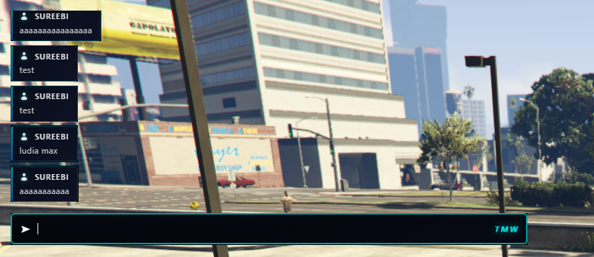

# qbx_chat_theme

Модерна тема за чат ресурса на FiveM, стилизирана с Mantine дизайн система.



## 📋 Описание

`qbx_chat_theme` е визуална тема за чат системата във FiveM, която предоставя чист и модерен интерфейс. Темата е част от Qbox проекта и използва Mantine стилове за по-добра визуализация на съобщенията в играта.

## ✨ Функции

- Модерен и чист дизайн
- Различни типове съобщения (default, console, join, quit, user)
- Персонализирани икони за различни типове съобщения
- Лесна интеграция с Qbox framework
- Поддръжка на ox_lib

## 📦 Инсталация

1. Клонирайте репозиторито в папката `resources` на вашия сървър:
```bash
git clone https://github.com/Qbox-project/qbx_chat_theme.git
```

2. Добавете ресурса в `server.cfg`:
```
ensure qbx_chat_theme
```

3. Рестартирайте сървъра

## 📁 Структура

```
qbx_chat_theme/
├── client/          # Клиентски скриптове
├── server/          # Сървърни скриптове
├── theme/           # CSS, JS и икони за темата
│   ├── icons/       # SVG и PNG икони
│   ├── app.css      # Стилове
│   └── app.js       # JavaScript логика
└── fxmanifest.lua   # Манифест файл
```

## 🎨 Типове съобщения

Темата поддържа следните типове съобщения:

- **default** - Стандартни съобщения с автор
- **defaultAlt** - Алтернативен формат
- **print** - Конзолни съобщения
- **join** - Съобщения при влизане на играч
- **quit** - Съобщения при излизане на играч
- **user** - Потребителски съобщения

## 👥 Автори

- **um - d4** | Qbox Team

## 📄 Лиценз

Вижте [LICENSE](LICENSE) файла за повече информация.

## 🔗 Връзки

- [GitHub Repository](https://github.com/Qbox-project/qbx_chat_theme)
- [Qbox Project](https://github.com/Qbox-project)

## 🎨 Икони

Иконите по подразбиране са от [Nucleo App](https://nucleoapp.com/).

---

**Версия:** 1.0.0
